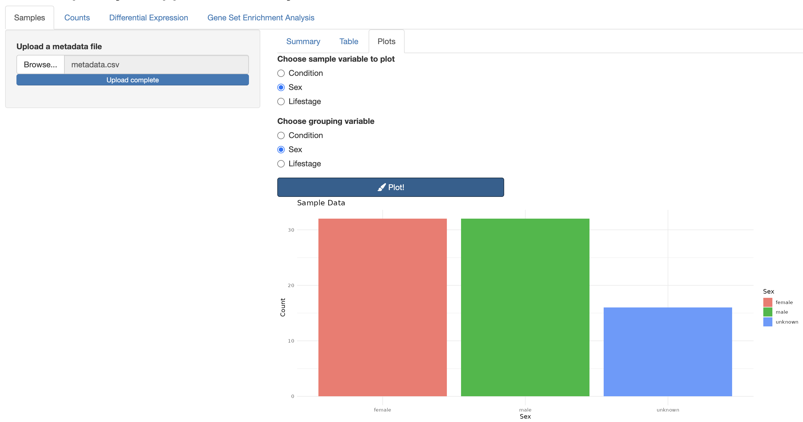
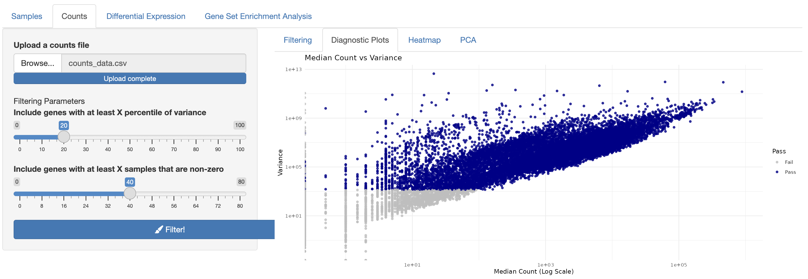
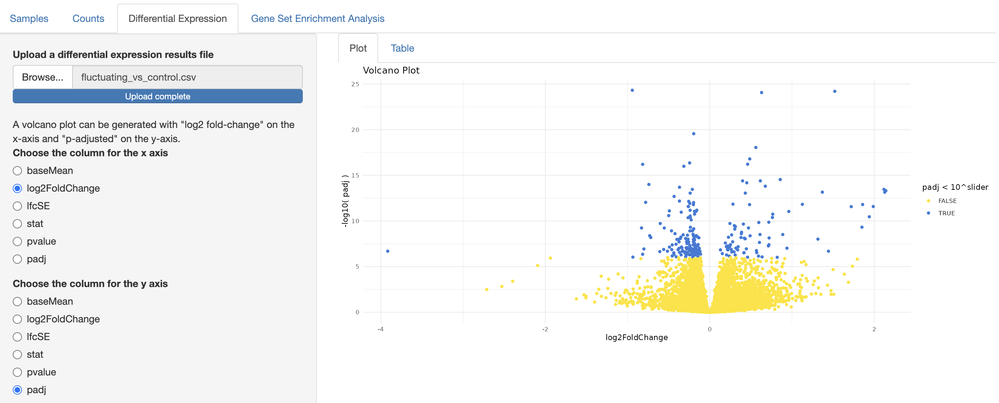
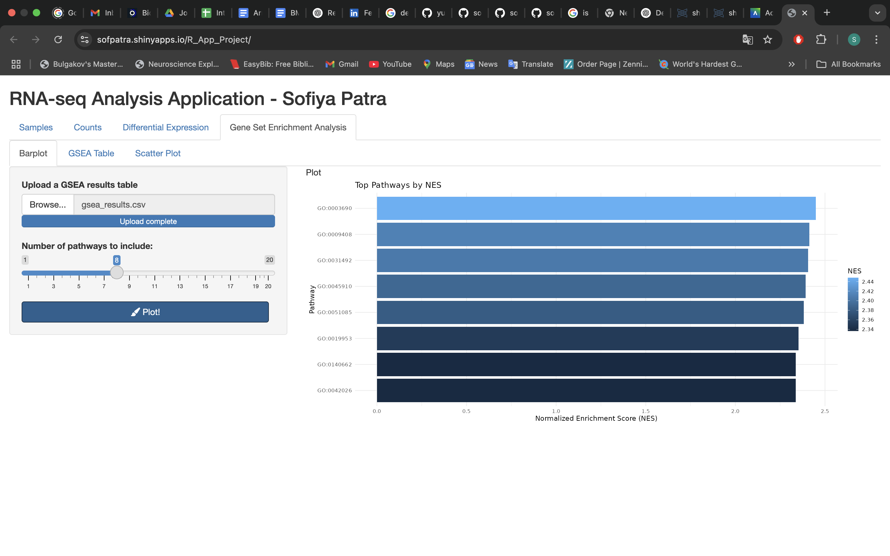

## RShiny App for Visualizing and Analyzing RNA-seq Results

This Rshiny application takes in the data generated in an RNA-seq experiment and visualizes it for dynamic analysis. The application expects the input of data files found in this repository's Data folder. Additionally, the R code for generating the differential expression results using DEseq2 and performing FGSEA analysis on the resulting data is included in this repository. 

The app is hosted here: https://sofpatra.shinyapps.io/R_App_Project/

### Functionality

Metadata Information Visualized

Counts Data Quality Control 

Differential Analysis Visualization 

FGSEA Visualization 

